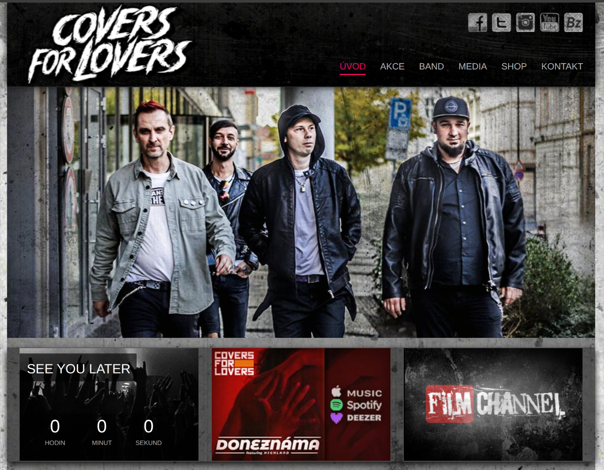

# Blok 2 – Webová stránka (HTML, CSS, JavaScript)

## Cíl

Chtěla jsem vytvořit webovou stránku o svém oblíbeném kapele. Stránka měla obsahovat základní informace, diskografii a formulář pro fanouškovský vzkaz. Jako interaktivní prvek jsem si vybrala přepínání světlého a tmavého režimu.

---

## Postup

Nejdřív jsem nakreslila wireframe na papír – tři sekce (hero s názvem, diskografie, formulář) a navigaci nahoře. Pak jsem si vybrala barevnou paletu na Coolors.co a stáhla dva fonty z Google Fonts.

HTML jsem psala jako první, bez CSS – jen struktura. Pak jsem přidávala styly postupně od layoutu (flexbox pro navigaci, grid pro karty s alby) k detailům. JavaScript na dark mode přidal třídu `.dark` na `<body>` a přes CSS variables se překreslily barvy celé stránky.

Největší problém byl formulář – nevěděla jsem, jak zabránit odeslání při prázdných polích. Vyřešila jsem to přes `addEventListener("submit", ...)` a kontrolu hodnot před odesláním.

---

## Výstupy

- Soubory `index.html`, `style.css`, `script.js` na GitHubu
- Nasazeno na GitHub Pages: [https://username.github.io/kapela-projekt](https://username.github.io/kapela-projekt)
- Screenshot výsledné stránky:



Ukázka JS funkce pro dark mode:

```javascript
const toggle = document.querySelector('#theme-toggle');

toggle.addEventListener('click', () => {
  document.body.classList.toggle('dark');
  toggle.textContent = document.body.classList.contains('dark')
    ? '☀️ Světlý režim'
    : '🌙 Tmavý režim';
});
```

---

## Reflexe

Stránka vypadá přibližně tak, jak jsem si představovala. Překvapilo mě, kolik času zabralo CSS – zejména centrování prvků. Teď už vím, že `display: flex` s `align-items: center` a `justify-content: center` je na to nejjednodušší cesta. Příště bych začala dříve s responzivitou, ne až na konci – přidávání media queries zpětně bylo zbytečně složité.

---

## Teoretické pozadí (stručně)

Stránka je postavená na třech vrstvách: HTML definuje strukturu (co na stránce je), CSS určuje vzhled (jak to vypadá) a JavaScript přidává chování (co se stane při akci). Pro layout jsem použila flexbox a CSS grid. Dark mode funguje přes CSS custom properties (proměnné) a přidávání třídy přes DOM. Podrobnější vysvětlení je v `teorie.md`.

---

## Zdroje

- [https://developer.mozilla.org/cs/](https://developer.mozilla.org/cs/) – reference pro HTML, CSS i JS
- [https://css-tricks.com/snippets/css/a-guide-to-flexbox/](https://css-tricks.com/snippets/css/a-guide-to-flexbox/) – flexbox vizuální přehled, hodně jsem se z toho učila
- [https://fonts.google.com/](https://fonts.google.com/) – fonty
- [https://coolors.co/](https://coolors.co/) – barevná paleta
