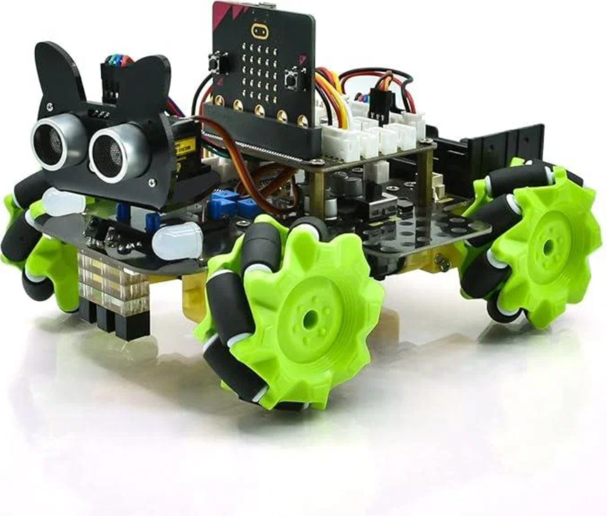
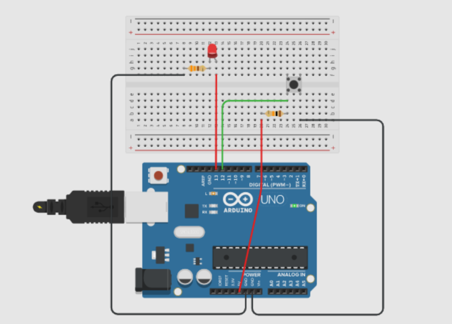

# Blok 4 – Fyzické počítání (Arduino)

## Cíl

Chtěla jsem sestrojit jednoduchý termostat – obvod, který měří teplotu čidlem DHT11 a zobrazuje ji na displeji. Pokud teplota přesáhne nastavenou hranici, rozsvítí se červená LED jako varování.

---

## Postup

Nejdřív jsem v Tinkercadu sestavila obvod virtuálně a otestovala kód, než jsem sáhla na fyzické součástky. Čidlo DHT11 potřebuje vlastní knihovnu – přidala jsem ji přes Library Manager v Arduino IDE.

Displej (LCD 16×2 s I2C modulem) byl ze začátku problém – nic nezobrazoval. Po hledání jsem zjistila, že I2C adresa mého modulu je `0x3F`, ne výchozí `0x27`, a po změně v kódu vše fungovalo.

Logiku jsem rozdělila do funkcí: `zmerTeplotu()`, `zobrazNaDispleji()` a `zkontrolujVarovani()`. Díky tomu bylo ladění přehledné.

---

## Výstupy

- Soubor `termostat.ino` na GitHubu
- Schéma zapojení (Tinkercad):



- Fotografie fyzického obvodu:



Ukázka hlavní smyčky programu:

```cpp
void loop() {
  float teplota = zmerTeplotu();

  if (isnan(teplota)) {
    lcd.print("Chyba cidla!");
  } else {
    zobrazNaDispleji(teplota);
    zkontrolujVarovani(teplota);
  }

  delay(2000); // čidlo DHT11 čte max. 1x za sekundu
}
```

---

## Reflexe

Nejvíce mě potěšilo, když fyzický obvod fungoval stejně jako simulace v Tinkercadu – myslela jsem, že to bude složitější. Největší komplikace byl displej s nesprávnou I2C adresou. Příště bych rovnou zkontrolovala adresu pomocí I2C skeneru (hotový sketch na internetu), než bych hodinu hledala chybu v kódu. Projekt mě bavil víc než čistě softwarové věci – je příjemné vidět výsledek fyzicky.

---

## Teoretické pozadí (stručně)

Mikrokontrolér Arduino spouští program neustále dokola v `loop()`. Piny jsou buď vstupní nebo výstupní – digitální (HIGH/LOW) nebo analogové (rozsah hodnot). Čidlo DHT11 komunikuje přes vlastní protokol a vyžaduje knihovnu. Displej komunikuje přes I2C sběrnici – dva vodiče (SDA, SCL) nahrazují mnoho propojení a každé zařízení má svou adresu. Podrobnější vysvětlení je v `teorie.md`.

---

## Zdroje

- [https://docs.arduino.cc/](https://docs.arduino.cc/) – reference funkcí
- [https://www.tinkercad.com/](https://www.tinkercad.com/) – simulátor, testovala jsem zde dřív než na fyzickém hardwaru
- [https://randomnerdtutorials.com/esp32-dht11-dht22-temperature-humidity-sensor/](https://randomnerdtutorials.com/esp32-dht11-dht22-temperature-humidity-sensor/) – návod na DHT11 (upravila jsem pro Uno)
