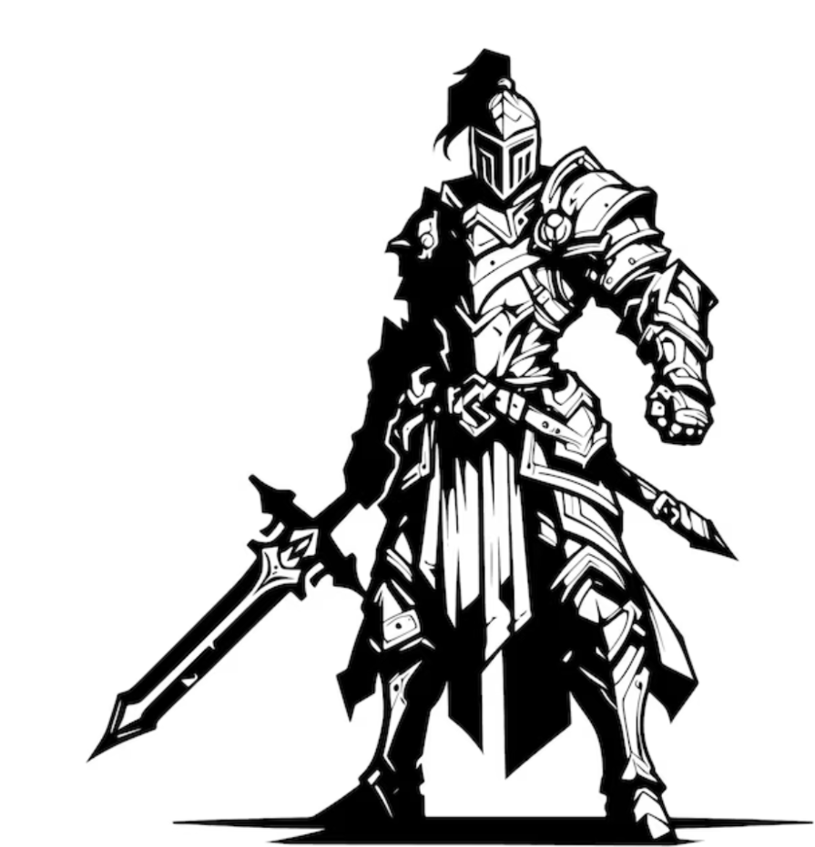
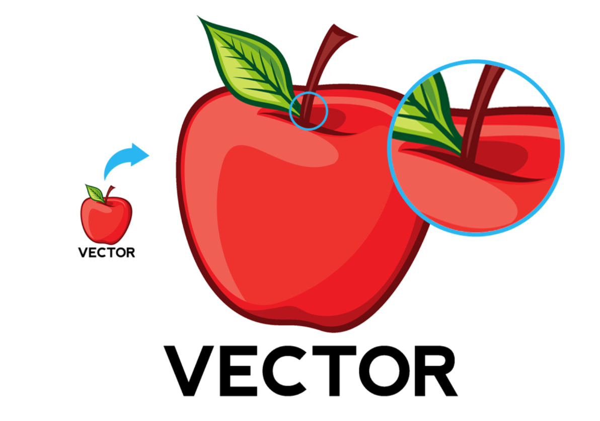

# Blok 5 – Vektorová grafika (Inkscape)

## Cíl

Chtěl jsem navrhnout logo pro fiktivní hudební festival „Letní zvuk". Logo mělo být jednoduché, použitelné na tričku i plakátu, a kombinovat text s ikonickým prvkem (reproduktor s vlnami).

---

## Postup

Začal jsem skicami na papíře – vyzkoušel jsem asi 5 různých konceptů, než jsem se rozhodl pro kruhové logo s reproduktorem uprostřed a textem po obvodu kruhu.

Reproduktor jsem sestavil z obdélníků a lichoběžníků. Zvukové vlny jsem udělal pomocí Bezierových křivek – nejdřív jsem kreslil oblouky ručně, ale výsledek byl nesouměrný. Vyřešil jsem to tak, že jsem udělal jeden oblouk přesně, zkopíroval ho a postupně zvětšoval.

Text po obvodu kruhu byl technicky nejsložitější – funkce Text → Put on Path v Inkscape ho umístila podél kruhu, ale bylo třeba ladit polohu. Na konci jsem text převedl na křivky, aby nebyl závislý na fontu.

---

## Výstupy

- Zdrojový soubor `letni_zvuk.svg`
- Export PNG pro různá použití:

- Logo funguje i v malé velikosti (favicon 32×32 px) – testoval jsem export.

---

## Reflexe

S výsledkem jsem spokojený. Logo je čitelné v malé i velké verzi, což byl jeden z mých cílů. Nejtěžší byla práce s Bezierovými křivkami – ovládání handles (táhel) trvalo, než jsem pochopil, jak fungují. Text po cestě je elegantní funkce, ale pro přesné umístění je nutné ladit manuálně. Příště bych začal se symetrickými objekty (Mirror přes osu) dříve – na začátku jsem hodně objektů kopíroval ručně a musel je pak ladit.

---

## Teoretické pozadí (stručně)

Vektorová grafika popisuje objekty matematicky jako body, křivky a tvary – na rozdíl od rastrové grafiky, která ukládá pixely. Výsledek je bezeztrátově škálovatelný. V Inkscape jsem pracoval s Bezierovými křivkami, Boolean operacemi a SVG formátem. Podrobné vysvětlení pojmů je v `teorie.md`.

---

## Zdroje

- [https://inkscape.org/learn/](https://inkscape.org/learn/) – tutoriály přímo od vývojářů
- [https://coolors.co/](https://coolors.co/) – barevná paleta
- [https://fonts.google.com/](https://fonts.google.com/) – font Oswald (použit v logu)
