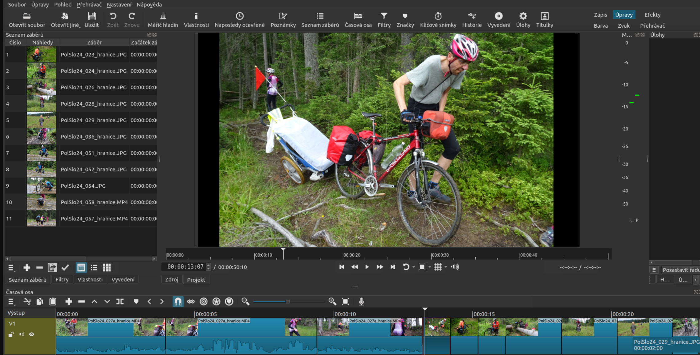

# Blok 7 – Střih videa (DaVinci Resolve)

## Cíl

Chtěl jsem natočit a sestříhat krátké video dokumentující jeden den ve škole – od příchodu ráno přes hodiny až po odchod. Video mělo mít dokumentární charakter bez komentáře, jen s hudbou a občasným titulkem.

---

## Postup

Natáčel jsem telefonem po dobu dvou dnů (první den nevyšlo osvětlení v učebně). Záběry jsem importoval do DaVinci Resolve, rozdělil do Binů podle části dne a pak sestavoval timeline v Edit page.

Střih jsem dělal na rytmus hudby – nejdřív jsem si označil beaty v audio stopě a pak záběry ořezával tak, aby střihy padaly přibližně na přechody. Zvuk z natáčení jsem ztlumil (školní hluk), ponechal jen pár záběrů se srozumitelným dialogem, kde jsem přidat Noise Reduction ve Fairlight page.

Titulky jsem přidal jako Text+ v Edit page – název lokace vždy na začátku nové části dne.

---

## Výstupy

- Exportovaný soubor `skola_den.mp4` (H.264, 1920×1080, 25 fps)
- Délka videa: 3 minuty 12 sekund
- Ukázka timeline:

---

## Reflexe

Video se mi líbí – rytmický střih s hudbou dává energii i nudným záběrům z chodby. Nejtěžší bylo natáčení: naučil jsem se, že protisvětlo (okno za objektem) záběr zničí. Druhý den jsem záměrně chodil natáčet do prostor, kde bylo světlo z boku nebo zepředu. Zvuk byl problém – školní prostředí je hlučné. Příště bych zvážil klopový mikrofon pro záběry s konkrétními osobami. DaVinci Resolve byl zpočátku matoucí (hodně stránek a panelů), ale jakmile jsem pochopil základní flow Media → Edit → Deliver, šlo to rychle.

---

## Teoretické pozadí (stručně)

Video je sekvence snímků přehrávaných rychlostí 25 fps – mozek vnímá plynulý pohyb. Střih je výběr a řazení záběrů do výsledného vyprávění. DaVinci Resolve pracuje s timeline, kde na stopách leží videoklipy a zvukové záznamy. Export generuje výsledný soubor komprimovaný kodekem H.264. Podrobnosti v `teorie.md`.

---

## Zdroje

- [https://www.blackmagicdesign.com/products/davinciresolve/training](https://www.blackmagicdesign.com/products/davinciresolve/training) – oficiální výukové materiály
- [https://www.youtube.com/@CaseyFaris](https://www.youtube.com/@CaseyFaris) – Casey Faris, přehledné tutoriály DaVinci
- [https://freemusicarchive.org/](https://freemusicarchive.org/) – hudba pod CC licencí použitá ve videu
