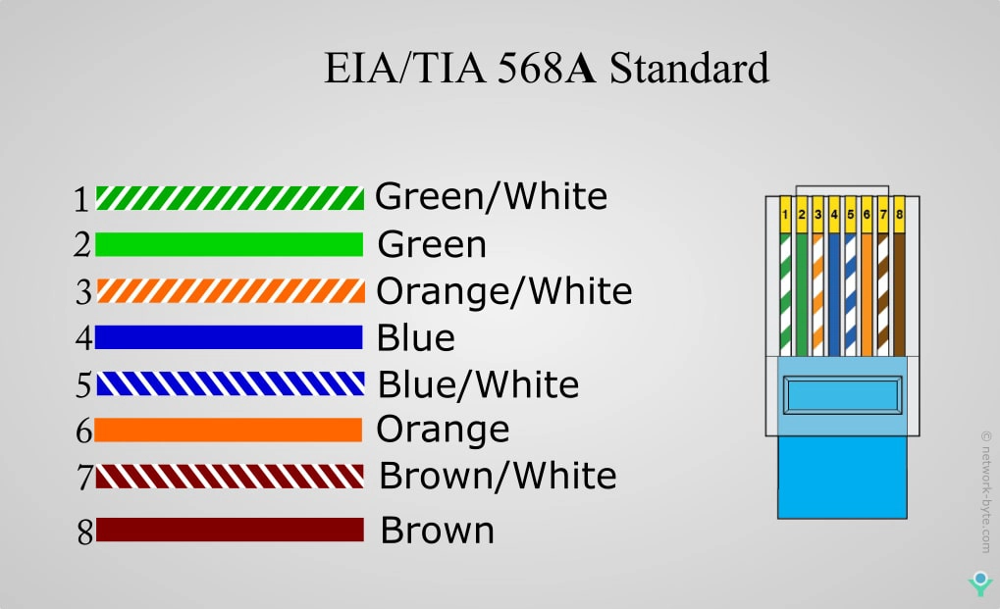

# Teorie – Blok 2: počítačové sítě a jejich základy

## Co jsem se naučil

Základy počítačových sítí - pojem počítačová síť - důvody pro síťové propojení - základní typy sítí (LAN, MAN, WAN) - klient–server × peer-to-peer

Fyzická topologie - pojem topologie sítě - fyzické topologie: sběrnice, hvězda, kruh, strom, mesh - výhody a nevýhody jednotlivých topologií 

Logická topologie - rozdíl fyzická × logická topologie - logické řízení přenosu dat - princip přenosu v Ethernetu - základní princip token passing 

Geografické členění sítí - PAN, LAN, CAN, MAN, WAN - internet jako globální síť - porovnání geografických typů sítí - opakování celého měsíce

Základy komunikace v síti - přenos dat v síti - paket, rámec - simplex, half-duplex, full-duplex - řízení přenosu dat 

Referenční model OSI - význam referenčního modelu - 7 vrstev OSI - funkce jednotlivých vrstev - příklady zařízení a protokolů v jednotlivých vrstvách 

Model TCP/IP - vrstvy modelu TCP/IP - porovnání OSI × TCP/IP - použití modelu v praxi - základní princip TCP a UDP 

Síťové protokoly - pojem protokol - aplikační protokoly: HTTP / HTTPS, FTP, SMTP, POP3, IMAP, DNS - shrnutí a opakování 

Přenosová média - dělení přenosových médií - metalická vedení - optická vlákna - bezdrátový přenos - porovnání vlastností médií 

Kabeláž - kroucená dvojlinka (UTP, STP, FTP) - kategorie kabelů (Cat 5e, 6, 6a) - maximální délky a rychlosti - optické kabely (singlemode, multimode)

Konektory a přenosové vlastnosti - konektory RJ-45, LC, SC - zapojení T568A a T568B - útlum, rušení, přeslechy - vliv kabeláže na rychlost přenosu 

Datový rozvaděč - účel datového rozvaděče - typy rozvaděčů - patch panel - patch kabely - organizace kabeláže 

Síťová karta a switch - síťová karta (NIC) – funkce - MAC adresa - typy síťových karet - switch – princip přepínání - základní parametry switchů 

Router a síťové služby - funkce routeru - rozdíl router × switch - směrování paketů - NAT - DHCP - základní firewall 

Rate limiting a ochrana proti bruteforce - princip rate limiting - omezení počtu požadavků - ochrana proti zahlcení sítě - bruteforce útok - způsoby ochrany (blokace IP, zpoždění, CAPTCHA) 

Logging a error handling - význam logování - typy logů - logování na routeru a serveru - typy síťových chyb - postupy řešení chyb - závěrečné opakování učiva 

## Slovník pojmů

ZÁKLADY 

 Počítačová síť – propojení zařízení  
    Host – koncové zařízení  
    Uzel (node) – prvek v síti  
    Klient – využívá služby  
    Server – poskytuje služby  
    Peer-to-peer – bez serveru  
    Protokol – pravidla komunikace  
    Topologie – struktura sítě  
    Komunikace – přenos dat  
    Bit / Byte – jednotky dat  
    Latency – zpoždění  
    Bandwidth – kapacita  

TOPOLOGIE 

  Bus – sdílený kabel  
  Star – centrální bod  
  Ring – kruh  
  Mesh – vše propojeno  
  Tree – strom  
  Hybrid – kombinace  

 

TYPY SÍTÍ 

  LAN – lokální  
  WAN – globální  
  MAN – město  
  PAN – osobní  
  WLAN – Wi-Fi  
  SAN – úložiště  
  VPN – virtuální síť  

FYZICKÁ VRSTVA 

  Signál – přenos informace  
  Analogový / digitální – typ signálu  
  UTP/STP – kroucená dvojlinka  
  Koaxiál – starší kabel  
  Optika – světelný přenos  
  Rušení (EMI) – narušení  
  Útlum – slábnutí  
  Repeater – zesílení  

LINKOVÁ VRSTVA 

  Frame – rámec  
  MAC adresa – fyzická adresa  
  Switch – přepínač  
  Bridge – spojení sítí  
  VLAN – virtuální síť  
  ARP – IP → MAC  
  Broadcast – všem  
  Unicast – jednomu  
  Multicast – skupině  
  CSMA/CD – řešení kolizí  

SÍŤOVÁ VRSTVA 

  IP adresa – identifikace  
  IPv4 / IPv6 – typy IP  
  Packet – paket  
  Router – směrování  
  Routing – hledání cesty  
  Subnet – podsíť  
  CIDR – zápis subnetu  
  Gateway – brána  
  NAT – překlad adres  

TRANSPORTNÍ VRSTVA 

  TCP – spolehlivý  
  UDP – rychlý  
  Segment – jednotka dat  
  Port – služba  
  Handshake – navázání spojení  
  Flow control – řízení toku  
  Congestion control – řízení zahlcení  
 
APLIKAČNÍ VRSTVA 

  Application – aplikace  
  Session – relace  
  Presentation – formát  
  Socket – spojení  

 PROTOKOLY 

   HTTP / HTTPS – web  
  FTP / SFTP / TFTP – soubory  
  SMTP – odesílání mailu  
  POP3 / IMAP – příjem mailu  
  DNS – doména → IP  
  DHCP – IP automaticky  
  ICMP – diagnostika  
  SNMP – správa  
  SSH – bezpečný přístup  
  Telnet – nebezpečný přístup  
  NTP – čas  

 WI-FI 

  SSID – název  
  Access Point – vysílač  
  WPA2 / WPA3 – zabezpečení  
  Kanál – frekvence  
    2.4 / 5 GHz – pásma  
  Roaming – přechod  

 

BEZPEČNOST 

  Firewall – filtr  
  Antivirus – ochrana  
  Malware – škodlivý SW  
  Virus – šíří se  
  Trojan – skrytý  
  Ransomware – vydírá  
  Spyware – sleduje  
  Phishing – podvod  
  Šifrování – ochrana dat  
  SSL/TLS – zabezpečení  
  VPN – bezpečné spojení  
  Autentizace – ověření  
  Autorizace – práva  
  Hash – otisk  
  Brute force – hádání  

ZAŘÍZENÍ 

  Hub – rozbočovač  
  Switch – přepínač  
  Router – směrovač  
  Modem – převod  
  Repeater – zesílení  
  Firewall appliance – ochrana  
  Load balancer – rozdělení zátěže  

ADRESACE 

  Privátní IP – interní  
  Veřejná IP – internet  
  Loopback – test (127.0.0.1)  
  Broadcast – všem  
  Multicast – skupině  
  NAT/PAT – překlad  

VÝKON 

  Throughput – reálná rychlost  
  Jitter – kolísání  
  Packet loss – ztráta  
  QoS – priorita  

SPRÁVA 

  Monitoring – sledování  
  Logy – záznamy  
  Backup – záloha  
  Update – aktualizace  
  Patch – oprava  
  Troubleshooting – řešení problémů 

## Zdroje

Online učebnice, kterou mám od pana učitele. 
AI + google. 
Učebnice, které máme doma.
